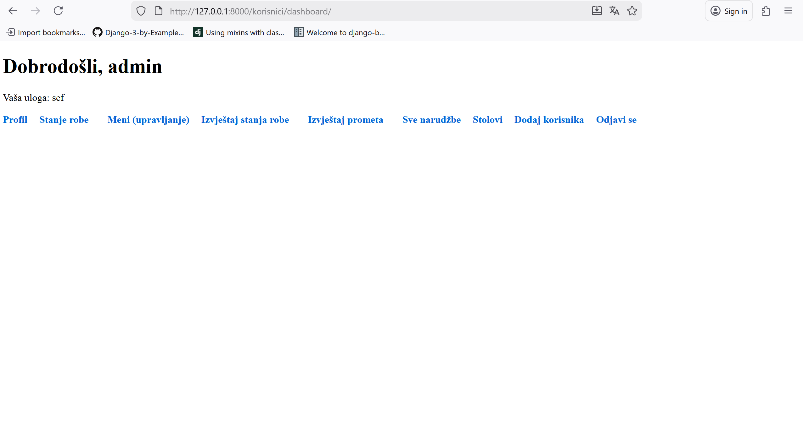

🍽️ Restoran – Django Web Application

Restoran is a full Django-based web application designed to showcase a modern restaurant website with menu browsing, item details, admin management, and optional ordering/reservation features.
This project is built as a portfolio example to demonstrate Django backend skills, clean project structure, and practical web-app development.

🚀 Features
✔ Basic Features

Menu (list of dishes & drinks)

Detailed page for each item

Categories (e.g., meals, desserts, beverages)

Static pages (home, about, contact)

Responsive HTML templates

✔ Intermediate Features (optional depending on your repo)

Add items to cart

Submit an order / reservation

Contact form

User authentication (login/register)

✔ Advanced / Professional Features (optional if implemented)

REST API (Django REST Framework)

Admin management for menu items, orders, reservations

Media file uploads (images for dishes)

Custom admin UI

Clean deployment-ready structure (Docker, .env, gunicorn, etc.)

You can check which of these you implemented and remove or keep them.

🛠️ Tech Stack

Python 3

Django (version varies depending on your project)

HTML / CSS / Bootstrap (or custom styling)

SQLite database (development)

(Optional) Django REST Framework

(Optional) Docker for deployment

📦 Project Structure
restoran/
│
├── restoran/            # Django project configuration (settings, urls, wsgi)
├── app/                 # Main restaurant application (models, views, urls)
│   ├── models.py
│   ├── views.py
│   ├── urls.py
│   ├── forms.py         # (optional)
│   └── templates/app/
│
├── templates/           # Global templates (base.html, layout, etc.)
├── static/              # CSS / JS / Images
├── media/               # Uploaded images (if enabled)
│
├── manage.py
├── README.md            # This file
├── requirements.txt
├── .gitignore
└── screenshots/         # Add UI images for portfolio

⚙️ Installation & Setup
1. Clone the repository
git clone https://github.com/USERNAME/restoran.git
cd restoran

2. Create virtual environment
python -m venv venv

# Windows
venv\Scripts\activate

# Linux / macOS
source venv/bin/activate

3. Install dependencies
pip install -r requirements.txt

4. Apply migrations
python manage.py migrate

5. Create a superuser (for admin panel)
python manage.py createsuperuser

6. Run the development server
python manage.py runserver

Visit the app at:
👉 http://127.0.0.1:8000/

Admin panel:
👉 http://127.0.0.1:8000/admin/

🔧 Environment Variables (optional)

If your project uses .env variables (recommended):

DEBUG=True
SECRET_KEY=your_secret_key_here
DATABASE_URL=sqlite:///db.sqlite3
ALLOWED_HOSTS=127.0.0.1, localhost

🐳 Docker Setup (optional)

If you want to show production-level skills:

Dockerfile

FROM python:3.11

WORKDIR /app

COPY requirements.txt .
RUN pip install -r requirements.txt

COPY . .

CMD ["gunicorn", "restoran.wsgi:application", "--bind", "0.0.0.0:8000"]

docker-compose.yml

version: "3"

services:
  restoran:
    build: .
    ports:
      - "8000:8000"
    volumes:
      - .:/app

Run with:

docker-compose up --build

📸 Screenshots

Add real screenshots for Upwork credibility:

/screenshots
    home.png
    menu.png
    item_detail.png
    login.png
    admin_panel.png

In README:

### Homepage  

### Menu  

🎯 Purpose of This Project

This project was created for:

Showcasing Django skills to potential clients on Upwork

Demonstrating full-stack web application structure

Practicing CRUD operations, templates, admin panel, forms

Providing a base for restaurant websites, menus, ordering systems, or delivery services

Clients can easily see:

Code quality

Ability to deliver real web applications

Understanding of Django MVC patterns

Ability to structure a project professionally

📬 Contact

If you want a fully customized restaurant web app, API, or production deployment, feel free to contact me.
